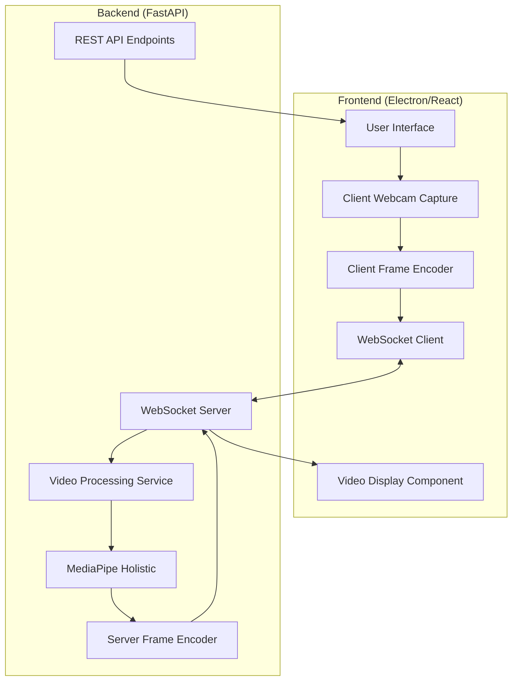
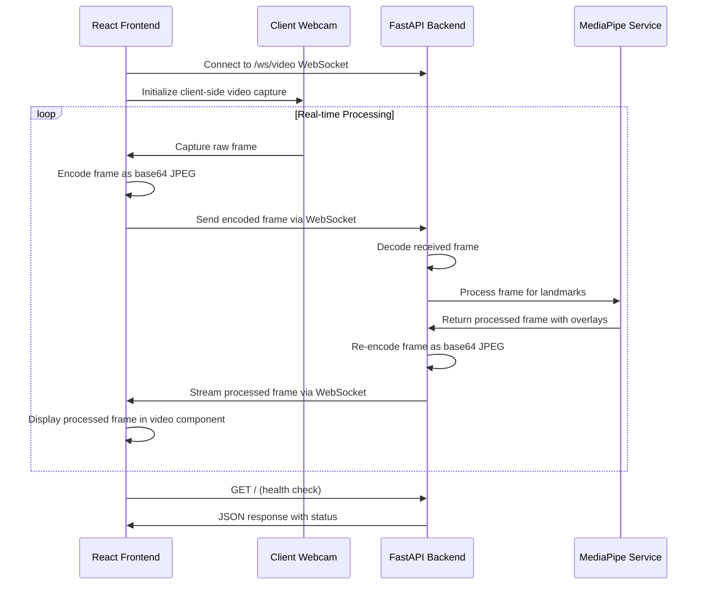

# Design Document

## Overview

The StorySign ASL Platform is a real-time computer vision application that provides interactive ASL learning through live video feedback. The system uses a client-server architecture where an Electron/React frontend communicates with a FastAPI backend that processes video streams using MediaPipe for pose and gesture detection.

The core technical challenge is achieving real-time video processing and streaming with minimal latency while maintaining accurate landmark detection. The system must handle continuous video capture, frame-by-frame MediaPipe processing, and efficient data transmission over WebSocket connections.

## Architecture

### System Components



### Data Flow Sequence



## Components and Interfaces

### Frontend Components

#### Main Application Component

- **Purpose**: Root component managing application state and layout
- **Responsibilities**:
  - Initialize WebSocket connections
  - Manage connection status
  - Coordinate between UI components
- **State Management**: React hooks for connection status, error messages, and video stream state

#### Video Display Component

- **Purpose**: Capture client webcam and render processed video stream with MediaPipe overlays
- **Props**:
  - `streamUrl`: WebSocket endpoint URL
  - `onConnectionChange`: Callback for connection status updates
- **Implementation**:
  - HTML5 video element for webcam capture using getUserMedia()
  - Canvas element for displaying processed frames with overlays
  - Frame capture and encoding logic for sending to backend

#### Control Panel Component

- **Purpose**: User interaction controls and system feedback
- **Features**:
  - "Test Backend" connectivity button
  - Connection status indicator
  - Error message display area
  - System health indicators

### Backend Services

#### FastAPI Application

- **Endpoints**:
  - `GET /`: Health check endpoint returning system status
  - `WebSocket /ws/video`: Real-time video streaming endpoint
- **Middleware**: CORS configuration for frontend communication
- **Error Handling**: Graceful degradation and error logging

#### Video Processing Service

- **Core Functions**:
  - `decode_frame(base64_data)`: Decode client-sent frame data
  - `process_frame(frame)`: Apply MediaPipe holistic processing
  - `encode_frame(frame)`: Convert processed frame to base64 JPEG
  - `handle_client_connection()`: Manage individual WebSocket client processing
- **Multi-Client Strategy**: Each WebSocket connection spawns a dedicated processing instance to ensure isolation and prevent interference between users

#### MediaPipe Integration

- **Model Configuration**: Holistic model with hand, face, and pose detection
- **Performance Optimization**:
  - Frame resolution optimization (640x480 recommended)
  - Processing confidence thresholds
  - Landmark drawing customization

## Data Models

### WebSocket Message Formats

#### Client to Server (Raw Frame)

```json
{
  "type": "raw_frame",
  "timestamp": "2024-08-20T10:30:00.000Z",
  "frame_data": "data:image/jpeg;base64,/9j/4AAQSkZJRgABAQAAAQ...",
  "metadata": {
    "frame_number": 1234,
    "client_id": "user_session_123"
  }
}
```

#### Server to Client (Processed Frame)

```json
{
  "type": "processed_frame",
  "timestamp": "2024-08-20T10:30:00.000Z",
  "frame_data": "data:image/jpeg;base64,/9j/4AAQSkZJRgABAQAAAQ...",
  "metadata": {
    "frame_number": 1234,
    "processing_time_ms": 16.7,
    "landmarks_detected": {
      "hands": true,
      "face": true,
      "pose": true
    }
  }
}
```

### REST API Response Format

```json
{
  "message": "Hello from the StorySign Backend!",
  "status": "healthy",
  "timestamp": "2024-08-20T10:30:00.000Z",
  "version": "1.0.0",
  "services": {
    "mediapipe": "ready",
    "websocket": "active",
    "active_connections": 0
  }
}
```

### Configuration Models

```python
class VideoConfig:
    width: int = 640
    height: int = 480
    fps: int = 30
    format: str = "MJPG"

class MediaPipeConfig:
    min_detection_confidence: float = 0.5
    min_tracking_confidence: float = 0.5
    model_complexity: int = 1
```

## Error Handling

### Frontend Error Scenarios

- **WebSocket Connection Failure**: Display reconnection UI with retry mechanism
- **Video Stream Interruption**: Show loading state and attempt automatic reconnection
- **Backend Unavailable**: Clear error message with troubleshooting steps

### Backend Error Scenarios

- **Webcam Access Denied**: Log error and return appropriate WebSocket error message
- **MediaPipe Processing Failure**: Continue operation with fallback frame processing
- **Memory/Performance Issues**: Implement frame dropping and quality adjustment

### Error Recovery Strategies

- **Exponential Backoff**: For WebSocket reconnection attempts
- **Graceful Degradation**: Continue operation without MediaPipe if processing fails
- **Resource Monitoring**: Track memory usage and processing performance

## Testing Strategy

### Unit Testing

- **Frontend**: Jest/React Testing Library for component behavior
- **Backend**: pytest for API endpoints and video processing functions
- **MediaPipe Integration**: Isolated tests for landmark detection accuracy

### Integration Testing

- **WebSocket Communication**: End-to-end message flow validation
- **Video Pipeline**: Frame processing latency and quality metrics
- **Error Scenarios**: Simulated failure conditions and recovery testing

### Performance Testing

- **Latency Benchmarks**: Target <100ms end-to-end frame processing
- **Memory Usage**: Monitor for memory leaks in continuous operation
- **CPU Utilization**: Optimize for sustainable real-time performance

### Manual Testing Scenarios

1. **Basic Connectivity**: Verify frontend can connect to backend and receive health status
2. **Video Stream Quality**: Validate MediaPipe overlays are accurate and responsive
3. **Error Recovery**: Test behavior when webcam is disconnected/reconnected
4. **Multi-session**: Verify system handles multiple WebSocket connections properly

## Technical Implementation Notes

### Performance Optimizations

- **Frame Rate Management**: Adaptive FPS based on processing capability
- **Compression Settings**: Balance between quality and transmission speed
- **Threading Strategy**: Separate threads for video capture, processing, and transmission

### Security Considerations

- **CORS Configuration**: Restrict origins to localhost during development
- **WebSocket Authentication**: Implement basic connection validation
- **Resource Limits**: Prevent excessive memory usage from video processing

### Development Environment Setup

- **Python Environment**: conda environment with MediaPipe, FastAPI, OpenCV
- **Node.js Setup**: React with Electron for desktop application packaging
- **Development Tools**: Hot reload for both frontend and backend during development
