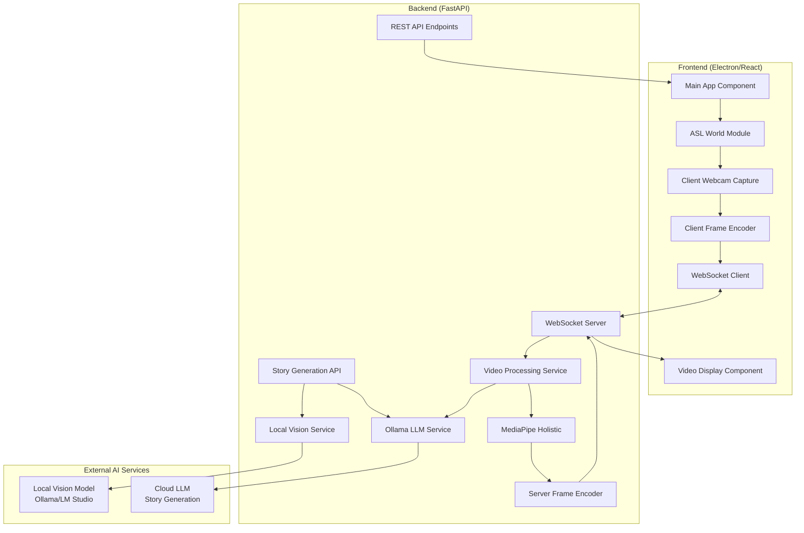
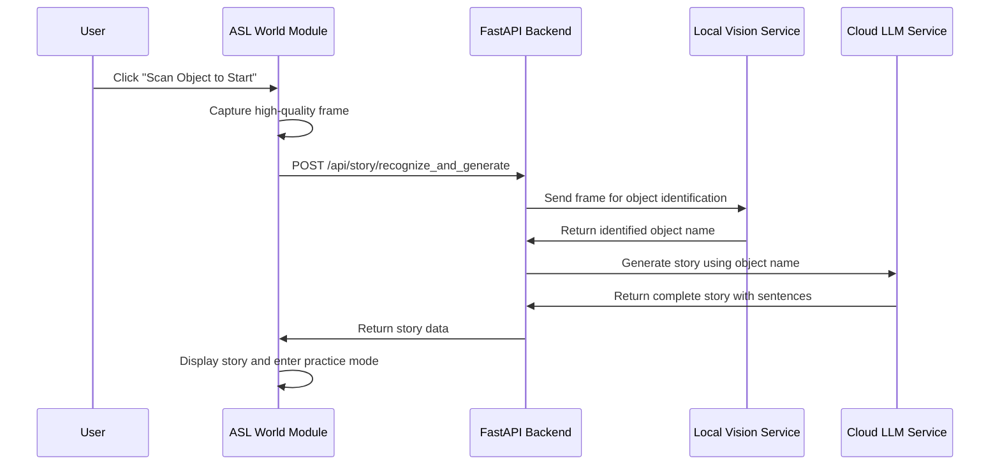
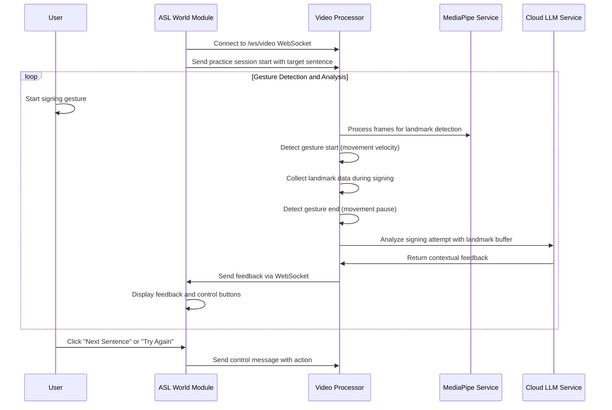

# Design Document

## Overview

The StorySign ASL Platform is a comprehensive ASL learning system that combines real-time computer vision with AI-powered story generation and interactive practice sessions. The system uses a hybrid AI architecture where a local vision model identifies objects from camera input, a cloud LLM generates personalized stories, and MediaPipe provides real-time gesture analysis and feedback.

The platform consists of an Electron/React frontend that communicates with a FastAPI backend through both REST APIs and WebSocket connections. The core technical challenges include achieving real-time video processing with minimal latency, integrating multiple AI services (local vision + cloud LLM), implementing gesture segmentation for practice sessions, and providing contextual feedback on ASL signing attempts.

## Architecture

### System Components



### Data Flow Sequences

#### Story Generation Flow



#### Practice Session Flow



## Components and Interfaces

### Frontend Components

#### Main Application Component

- **Purpose**: Root component managing application state and workflow coordination
- **Responsibilities**:
  - Initialize WebSocket connections
  - Manage connection status
  - Coordinate between story generation and practice modes
  - Handle AI service communication
- **State Management**: React hooks for connection status, story data, practice session state, and error messages

#### ASL World Module Component

- **Purpose**: Main learning interface for story generation and sentence practice
- **Props**:
  - `storyData`: Array of story sentences
  - `currentSentenceIndex`: Index of sentence being practiced
  - `latestFeedback`: AI-generated feedback on signing attempt
- **Features**:
  - "Scan Object to Start" button for story generation
  - Story display with sentence highlighting
  - Practice controls ("Next Sentence", "Try Again")
  - Feedback display area
  - Loading indicators for AI processing

#### Video Display Component

- **Purpose**: Capture client webcam and render processed video stream with MediaPipe overlays
- **Props**:
  - `streamUrl`: WebSocket endpoint URL
  - `onConnectionChange`: Callback for connection status updates
  - `practiceMode`: Boolean indicating if in practice session
- **Implementation**:
  - HTML5 video element for webcam capture using getUserMedia()
  - Canvas element for displaying processed frames with overlays
  - Frame capture and encoding logic for sending to backend
  - Visual indicators for gesture detection states

#### Control Panel Component

- **Purpose**: User interaction controls and system feedback
- **Features**:
  - "Test Backend" connectivity button
  - Connection status indicator
  - Error message display area
  - System health indicators
  - AI service status indicators

### Backend Services

#### FastAPI Application

- **Endpoints**:
  - `GET /`: Health check endpoint returning system status
  - `POST /api/story/recognize_and_generate`: Object recognition and story generation
  - `WebSocket /ws/video`: Real-time video streaming endpoint
- **Middleware**: CORS configuration for frontend communication
- **Error Handling**: Graceful degradation and error logging

#### Local Vision Service

- **Purpose**: Interface with local vision models for object identification
- **Core Functions**:
  - `identify_object(base64_image)`: Send image to local vision model
  - `parse_vision_response(response)`: Extract object name from model response
  - `validate_identification(object_name)`: Ensure valid object identification
- **Configuration**: Configurable endpoint URL for Ollama or LM Studio services
- **Error Handling**: Fallback behavior when local vision service is unavailable

#### Ollama LLM Service

- **Purpose**: Interface with cloud LLM for story generation and signing analysis
- **Core Functions**:
  - `generate_story(object_name)`: Create story based on identified object
  - `analyze_signing_attempt(landmark_buffer, target_sentence)`: Provide feedback on signing
  - `format_story_response(story_text)`: Parse story into sentence array
- **Configuration**: Configurable model selection and API parameters
- **Performance**: Async processing to prevent blocking video stream

#### Video Processing Service (Enhanced)

- **Core Functions**:
  - `decode_frame(base64_data)`: Decode client-sent frame data
  - `process_frame(frame)`: Apply MediaPipe holistic processing
  - `encode_frame(frame)`: Convert processed frame to base64 JPEG
  - `handle_client_connection()`: Manage individual WebSocket client processing
- **New Practice Mode Functions**:
  - `detect_gesture_start(landmarks)`: Identify beginning of signing motion
  - `detect_gesture_end(landmarks)`: Identify end of signing motion
  - `collect_landmark_data(landmarks)`: Buffer landmark data during signing
  - `analyze_gesture_sequence(landmark_buffer, target_sentence)`: Coordinate with LLM for feedback
- **State Management**: Track practice session state, target sentences, and gesture detection
- **Multi-Client Strategy**: Each WebSocket connection maintains isolated practice session state

#### MediaPipe Integration (Enhanced)

- **Model Configuration**: Holistic model with hand, face, and pose detection
- **Performance Optimization**:
  - Frame resolution optimization (640x480 recommended)
  - Processing confidence thresholds
  - Landmark drawing customization
- **Gesture Analysis Features**:
  - Hand movement velocity calculation
  - Gesture boundary detection
  - Landmark data normalization for analysis

## Data Models

### WebSocket Message Formats

#### Client to Server (Raw Frame)

```json
{
  "type": "raw_frame",
  "timestamp": "2024-08-20T10:30:00.000Z",
  "frame_data": "data:image/jpeg;base64,/9j/4AAQSkZJRgABAQAAAQ...",
  "metadata": {
    "frame_number": 1234,
    "client_id": "user_session_123"
  }
}
```

#### Client to Server (Practice Control)

```json
{
  "type": "control",
  "action": "next_sentence",
  "data": {
    "sentence_index": 2,
    "target_sentence": "The cat sat on the mat."
  }
}
```

#### Server to Client (Processed Frame)

```json
{
  "type": "processed_frame",
  "timestamp": "2024-08-20T10:30:00.000Z",
  "frame_data": "data:image/jpeg;base64,/9j/4AAQSkZJRgABAQAAAQ...",
  "metadata": {
    "frame_number": 1234,
    "processing_time_ms": 16.7,
    "landmarks_detected": {
      "hands": true,
      "face": true,
      "pose": true
    },
    "gesture_state": "listening"
  }
}
```

#### Server to Client (ASL Feedback)

```json
{
  "type": "asl_feedback",
  "timestamp": "2024-08-20T10:30:00.000Z",
  "data": {
    "target_sentence": "The cat sat on the mat.",
    "feedback": "Good hand positioning! Try to make the 'cat' sign more distinct by keeping your fingers closer together.",
    "confidence_score": 0.75,
    "suggestions": [
      "Focus on hand shape clarity",
      "Maintain consistent signing space"
    ]
  }
}
```

### REST API Response Formats

#### Health Check Response

```json
{
  "message": "Hello from the StorySign Backend!",
  "status": "healthy",
  "timestamp": "2024-08-20T10:30:00.000Z",
  "version": "1.0.0",
  "services": {
    "mediapipe": "ready",
    "websocket": "active",
    "local_vision": "connected",
    "cloud_llm": "ready",
    "active_connections": 0
  }
}
```

#### Story Generation Response

```json
{
  "success": true,
  "story": {
    "title": "The Adventure of the Red Ball",
    "sentences": [
      "Once upon a time, there was a bright red ball.",
      "The ball loved to bounce in the sunny park.",
      "Children would come to play with the happy ball.",
      "One day, the ball rolled into a magical forest.",
      "The ball made many new friends among the trees."
    ],
    "identified_object": "ball",
    "generation_time_ms": 2340
  },
  "timestamp": "2024-08-20T10:30:00.000Z"
}
```

### Configuration Models

```python
class VideoConfig:
    width: int = 640
    height: int = 480
    fps: int = 30
    format: str = "MJPG"

class MediaPipeConfig:
    min_detection_confidence: float = 0.5
    min_tracking_confidence: float = 0.5
    model_complexity: int = 1

class LocalVisionConfig:
    service_url: str = "http://localhost:11434"
    model_name: str = "moondream2"
    timeout_seconds: int = 30
    max_retries: int = 3

class OllamaConfig:
    service_url: str = "http://localhost:11434"
    story_model: str = "llama3.1"
    analysis_model: str = "llama3.1"
    timeout_seconds: int = 60
    max_tokens: int = 1000

class GestureDetectionConfig:
    velocity_threshold: float = 0.02
    pause_duration_ms: int = 1000
    min_gesture_duration_ms: int = 500
    landmark_buffer_size: int = 100
```

## AI Integration Architecture

### Hybrid AI Processing Pipeline

The system employs a hybrid approach combining local and cloud AI services for optimal performance and functionality:

#### Local Vision Processing

- **Purpose**: Fast, privacy-preserving object identification
- **Implementation**: Local vision model (moondream2, phi3:vision) via Ollama/LM Studio
- **Benefits**: Low latency, no data transmission to external services
- **Fallback**: Manual object selection if local service unavailable

#### Cloud LLM Processing

- **Purpose**: Rich story generation and contextual ASL feedback
- **Implementation**: Cloud-based large language model via Ollama service
- **Benefits**: Advanced reasoning, contextual understanding, detailed feedback
- **Optimization**: Async processing to prevent blocking video stream

#### Processing Flow Integration

1. **Object Recognition**: Local vision model identifies objects from camera frames
2. **Story Generation**: Cloud LLM creates personalized stories using identified objects
3. **Gesture Analysis**: MediaPipe provides landmark data during signing practice
4. **Feedback Generation**: Cloud LLM analyzes gesture data and provides contextual feedback

### AI Service Management

#### Service Health Monitoring

- Periodic health checks for all AI services
- Graceful degradation when services are unavailable
- User notification of service status changes

#### Performance Optimization

- Caching of frequently used story templates
- Batching of analysis requests when possible
- Timeout management to prevent UI blocking

## Error Handling

### Frontend Error Scenarios

- **WebSocket Connection Failure**: Display reconnection UI with retry mechanism
- **Video Stream Interruption**: Show loading state and attempt automatic reconnection
- **Backend Unavailable**: Clear error message with troubleshooting steps
- **Story Generation Failure**: Display error message with option to retry or manual object selection
- **AI Service Timeout**: Show timeout message and allow user to try again

### Backend Error Scenarios

- **Webcam Access Denied**: Log error and return appropriate WebSocket error message
- **MediaPipe Processing Failure**: Continue operation with fallback frame processing
- **Memory/Performance Issues**: Implement frame dropping and quality adjustment
- **Local Vision Service Unavailable**: Provide manual object selection fallback
- **Cloud LLM Service Failure**: Display service unavailable message with retry options
- **Gesture Detection Failure**: Continue video processing without analysis features

### Error Recovery Strategies

- **Exponential Backoff**: For WebSocket reconnection attempts and AI service retries
- **Graceful Degradation**: Continue operation without AI features if services fail
- **Resource Monitoring**: Track memory usage and processing performance
- **Service Fallbacks**: Manual object selection when vision service fails
- **Timeout Management**: Prevent indefinite waiting for AI service responses
- **User Feedback**: Clear communication about service status and available alternatives

## Testing Strategy

### Unit Testing

- **Frontend**: Jest/React Testing Library for component behavior
- **Backend**: pytest for API endpoints and video processing functions
- **MediaPipe Integration**: Isolated tests for landmark detection accuracy

### Integration Testing

- **WebSocket Communication**: End-to-end message flow validation
- **Video Pipeline**: Frame processing latency and quality metrics
- **Error Scenarios**: Simulated failure conditions and recovery testing

### Performance Testing

- **Latency Benchmarks**: Target <100ms end-to-end frame processing
- **Memory Usage**: Monitor for memory leaks in continuous operation
- **CPU Utilization**: Optimize for sustainable real-time performance

### Manual Testing Scenarios

1. **Basic Connectivity**: Verify frontend can connect to backend and receive health status
2. **Video Stream Quality**: Validate MediaPipe overlays are accurate and responsive
3. **Error Recovery**: Test behavior when webcam is disconnected/reconnected
4. **Multi-session**: Verify system handles multiple WebSocket connections properly

## Technical Implementation Notes

### Performance Optimizations

- **Frame Rate Management**: Adaptive FPS based on processing capability
- **Compression Settings**: Balance between quality and transmission speed
- **Threading Strategy**: Separate threads for video capture, processing, and transmission

### Security Considerations

- **CORS Configuration**: Restrict origins to localhost during development
- **WebSocket Authentication**: Implement basic connection validation
- **Resource Limits**: Prevent excessive memory usage from video processing

### Development Environment Setup

- **Python Environment**: conda environment with MediaPipe, FastAPI, OpenCV
- **Node.js Setup**: React with Electron for desktop application packaging
- **Development Tools**: Hot reload for both frontend and backend during development
