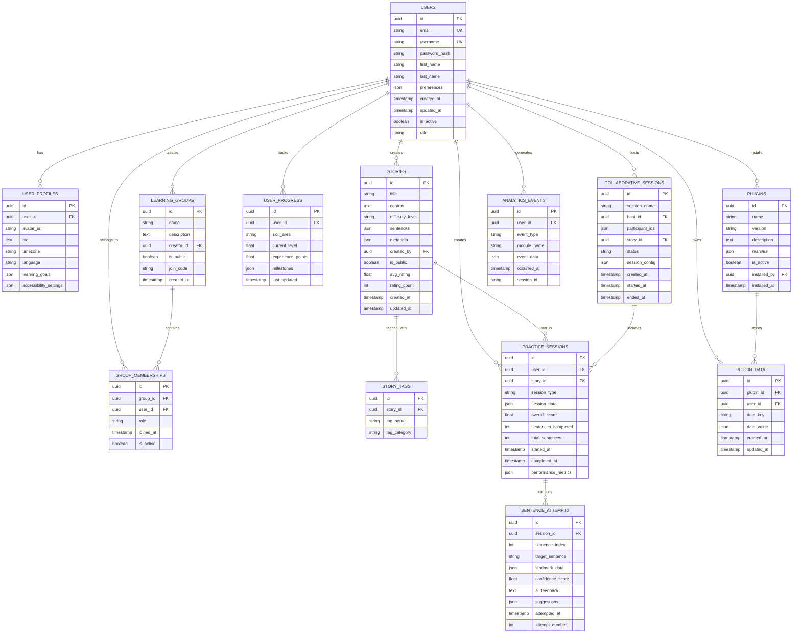

# Design Document

## Overview

The StorySign Database & Modularity Enhancement transforms the existing single-session ASL Platform into a comprehensive, multi-user learning management system. This design implements a modular plugin architecture, persistent data storage with TiDB, user management, progress tracking, and collaborative learning features while maintaining backward compatibility with the existing real-time video processing capabilities.

The system evolves from a monolithic React application to a scalable platform supporting multiple learning modules (ASL World, Harmony, Reconnect) with shared infrastructure for user management, content libraries, analytics, and extensibility.

## Architecture

### System Architecture Overview


### Database Architecture



## Components and Interfaces

### Frontend Architecture

#### Platform Shell Component

**Purpose**: Main application wrapper providing shared infrastructure
**Responsibilities**:

- User authentication state management
- Global navigation and routing
- Theme and accessibility settings
- Plugin loading and management
- Real-time notifications

```typescript
interface PlatformShellProps {
  user: User | null;
  modules: ModuleDefinition[];
  plugins: Plugin[];
  theme: ThemeConfig;
}

interface ModuleDefinition {
  id: string;
  name: string;
  route: string;
  component: React.ComponentType;
  permissions: string[];
  icon: string;
}
```

#### Module Interface Standard

**Purpose**: Standardized interface for all learning modules
**Contract**: Each module must implement the ModuleInterface

```typescript
interface ModuleInterface {
  // Module metadata
  readonly moduleId: string;
  readonly version: string;
  readonly dependencies: string[];

  // Lifecycle methods
  initialize(context: ModuleContext): Promise<void>;
  cleanup(): Promise<void>;

  // Data access
  getUserData(userId: string): Promise<any>;
  saveUserData(userId: string, data: any): Promise<void>;

  // Analytics integration
  trackEvent(event: AnalyticsEvent): void;

  // Plugin integration
  registerPluginHooks(hooks: PluginHook[]): void;
}

interface ModuleContext {
  user: User;
  database: DatabaseService;
  analytics: AnalyticsService;
  plugins: PluginService;
  realtime: RealtimeService;
}
```

#### Plugin System Architecture

**Purpose**: Extensible plugin system for custom functionality
**Implementation**: Dynamic loading with sandboxed execution

```typescript
interface Plugin {
  manifest: PluginManifest;
  hooks: PluginHook[];
  components: React.ComponentType[];
  services: PluginService[];
}

interface PluginManifest {
  id: string;
  name: string;
  version: string;
  description: string;
  author: string;
  permissions: Permission[];
  dependencies: Dependency[];
  hooks: HookDefinition[];
}

interface PluginHook {
  type: "before" | "after" | "replace";
  target: string; // e.g., 'asl-world.practice-session.start'
  handler: (context: HookContext) => Promise<any>;
}
```

### Backend Architecture

#### Modular API Structure

**FastAPI Router Organization**:

```python
# backend/api/v1/router.py
from fastapi import APIRouter
from .auth import router as auth_router
from .users import router as users_router
from .asl_world import router as asl_world_router
from .harmony import router as harmony_router
from .reconnect import router as reconnect_router
from .content import router as content_router
from .analytics import router as analytics_router
from .plugins import router as plugins_router

api_router = APIRouter()
api_router.include_router(auth_router, prefix="/auth", tags=["authentication"])
api_router.include_router(users_router, prefix="/users", tags=["users"])
api_router.include_router(asl_world_router, prefix="/asl-world", tags=["asl-world"])
api_router.include_router(harmony_router, prefix="/harmony", tags=["harmony"])
api_router.include_router(reconnect_router, prefix="/reconnect", tags=["reconnect"])
api_router.include_router(content_router, prefix="/content", tags=["content"])
api_router.include_router(analytics_router, prefix="/analytics", tags=["analytics"])
api_router.include_router(plugins_router, prefix="/plugins", tags=["plugins"])
```

#### Database Service Layer

**Purpose**: Abstracted database operations with TiDB optimization
**Implementation**: Repository pattern with async operations

```python
# backend/services/database.py
from abc import ABC, abstractmethod
from typing import List, Optional, Dict, Any
from sqlalchemy.ext.asyncio import AsyncSession
from models.base import BaseModel

class Repository(ABC):
    def __init__(self, session: AsyncSession):
        self.session = session

    @abstractmethod
    async def create(self, obj: BaseModel) -> BaseModel:
        pass

    @abstractmethod
    async def get_by_id(self, id: str) -> Optional[BaseModel]:
        pass

    @abstractmethod
    async def update(self, id: str, data: Dict[str, Any]) -> Optional[BaseModel]:
        pass

    @abstractmethod
    async def delete(self, id: str) -> bool:
        pass

class UserRepository(Repository):
    async def get_by_email(self, email: str) -> Optional[User]:
        # TiDB-optimized query implementation
        pass

    async def get_learning_progress(self, user_id: str) -> List[UserProgress]:
        # Complex analytics query optimized for TiDB
        pass

class PracticeSessionRepository(Repository):
    async def get_user_sessions(
        self,
        user_id: str,
        limit: int = 50,
        offset: int = 0
    ) -> List[PracticeSession]:
        # Paginated query with TiDB performance optimization
        pass

    async def get_performance_analytics(
        self,
        user_id: str,
        date_range: DateRange
    ) -> Dict[str, Any]:
        # Aggregated analytics query
        pass
```

#### Plugin System Backend

**Purpose**: Secure plugin execution environment
**Implementation**: Sandboxed execution with controlled API access

```python
# backend/services/plugin_service.py
class PluginService:
    def __init__(self, db: DatabaseService, security: SecurityService):
        self.db = db
        self.security = security
        self.loaded_plugins: Dict[str, Plugin] = {}

    async def load_plugin(self, plugin_id: str) -> Plugin:
        # Validate plugin security and permissions
        manifest = await self.db.get_plugin_manifest(plugin_id)
        self.security.validate_plugin_permissions(manifest)

        # Load plugin in sandboxed environment
        plugin = await self._load_sandboxed_plugin(manifest)
        self.loaded_plugins[plugin_id] = plugin

        return plugin

    async def execute_plugin_hook(
        self,
        hook_name: str,
        context: Dict[str, Any]
    ) -> Any:
        # Execute all registered hooks for this event
        results = []
        for plugin in self.loaded_plugins.values():
            if hook_name in plugin.hooks:
                result = await plugin.execute_hook(hook_name, context)
                results.append(result)

        return results
```

## Data Models

### User Management Models

```python
# backend/models/user.py
from sqlalchemy import Column, String, Boolean, DateTime, JSON
from sqlalchemy.dialects.mysql import CHAR
from models.base import BaseModel, TimestampMixin

class User(BaseModel, TimestampMixin):
    __tablename__ = "users"

    id = Column(CHAR(36), primary_key=True, default=lambda: str(uuid4()))
    email = Column(String(255), unique=True, nullable=False, index=True)
    username = Column(String(100), unique=True, nullable=False, index=True)
    password_hash = Column(String(255), nullable=False)
    first_name = Column(String(100))
    last_name = Column(String(100))
    preferences = Column(JSON)
    is_active = Column(Boolean, default=True)
    role = Column(String(50), default="learner")

class UserProfile(BaseModel, TimestampMixin):
    __tablename__ = "user_profiles"

    id = Column(CHAR(36), primary_key=True, default=lambda: str(uuid4()))
    user_id = Column(CHAR(36), ForeignKey("users.id"), nullable=False)
    avatar_url = Column(String(500))
    bio = Column(Text)
    timezone = Column(String(50))
    language = Column(String(10), default="en")
    learning_goals = Column(JSON)
    accessibility_settings = Column(JSON)
```

### Learning Progress Models

```python
# backend/models/progress.py
class PracticeSession(BaseModel, TimestampMixin):
    __tablename__ = "practice_sessions"

    id = Column(CHAR(36), primary_key=True, default=lambda: str(uuid4()))
    user_id = Column(CHAR(36), ForeignKey("users.id"), nullable=False, index=True)
    story_id = Column(CHAR(36), ForeignKey("stories.id"), nullable=False)
    session_type = Column(String(50), nullable=False)  # 'individual', 'collaborative'
    session_data = Column(JSON)  # Module-specific session data
    overall_score = Column(Float)
    sentences_completed = Column(Integer, default=0)
    total_sentences = Column(Integer)
    started_at = Column(DateTime(timezone=True), nullable=False)
    completed_at = Column(DateTime(timezone=True))
    performance_metrics = Column(JSON)

class SentenceAttempt(BaseModel):
    __tablename__ = "sentence_attempts"

    id = Column(CHAR(36), primary_key=True, default=lambda: str(uuid4()))
    session_id = Column(CHAR(36), ForeignKey("practice_sessions.id"), nullable=False)
    sentence_index = Column(Integer, nullable=False)
    target_sentence = Column(Text, nullable=False)
    landmark_data = Column(JSON)  # MediaPipe landmark data
    confidence_score = Column(Float)
    ai_feedback = Column(Text)
    suggestions = Column(JSON)
    attempted_at = Column(DateTime(timezone=True), nullable=False)
    attempt_number = Column(Integer, default=1)
```

### Content Management Models

```python
# backend/models/content.py
class Story(BaseModel, TimestampMixin):
    __tablename__ = "stories"

    id = Column(CHAR(36), primary_key=True, default=lambda: str(uuid4()))
    title = Column(String(255), nullable=False)
    content = Column(Text)
    difficulty_level = Column(String(50), nullable=False, index=True)
    sentences = Column(JSON, nullable=False)  # Array of sentences
    metadata = Column(JSON)  # Additional story metadata
    created_by = Column(CHAR(36), ForeignKey("users.id"))
    is_public = Column(Boolean, default=False)
    avg_rating = Column(Float, default=0.0)
    rating_count = Column(Integer, default=0)

class StoryTag(BaseModel):
    __tablename__ = "story_tags"

    id = Column(CHAR(36), primary_key=True, default=lambda: str(uuid4()))
    story_id = Column(CHAR(36), ForeignKey("stories.id"), nullable=False)
    tag_name = Column(String(100), nullable=False, index=True)
    tag_category = Column(String(50), index=True)  # 'topic', 'skill', 'age_group'
```

## API Design

### RESTful API Endpoints

#### Authentication & User Management

```
POST   /api/v1/auth/register
POST   /api/v1/auth/login
POST   /api/v1/auth/logout
POST   /api/v1/auth/refresh
GET    /api/v1/users/profile
PUT    /api/v1/users/profile
GET    /api/v1/users/progress
GET    /api/v1/users/analytics
```

#### Content Management

```
GET    /api/v1/content/stories
POST   /api/v1/content/stories
GET    /api/v1/content/stories/{id}
PUT    /api/v1/content/stories/{id}
DELETE /api/v1/content/stories/{id}
GET    /api/v1/content/stories/search
GET    /api/v1/content/tags
```

#### Practice Sessions

```
POST   /api/v1/practice/sessions
GET    /api/v1/practice/sessions
GET    /api/v1/practice/sessions/{id}
PUT    /api/v1/practice/sessions/{id}
POST   /api/v1/practice/sessions/{id}/attempts
GET    /api/v1/practice/sessions/{id}/analytics
```

#### Module-Specific APIs

```
# ASL World
POST   /api/v1/asl-world/generate-story
POST   /api/v1/asl-world/analyze-gesture
GET    /api/v1/asl-world/user-stats

# Harmony (Future)
POST   /api/v1/harmony/create-group-session
GET    /api/v1/harmony/group-sessions
POST   /api/v1/harmony/join-session

# Reconnect (Future)
GET    /api/v1/reconnect/community-challenges
POST   /api/v1/reconnect/submit-challenge
GET    /api/v1/reconnect/leaderboard
```

### WebSocket API Design

#### Real-time Communication Channels

```typescript
// WebSocket message types
interface WebSocketMessage {
  type: string;
  channel: string;
  data: any;
  timestamp: string;
  user_id?: string;
}

// Channel types
enum ChannelType {
  VIDEO_PROCESSING = "video-processing",
  COLLABORATIVE_SESSION = "collaborative-session",
  REAL_TIME_FEEDBACK = "real-time-feedback",
  NOTIFICATIONS = "notifications",
  PLUGIN_EVENTS = "plugin-events",
}

// Message examples
interface VideoProcessingMessage extends WebSocketMessage {
  type: "raw_frame" | "processed_frame" | "gesture_analysis";
  channel: "video-processing";
  data: {
    frame_data?: string;
    landmarks?: any;
    analysis_result?: any;
  };
}

interface CollaborativeMessage extends WebSocketMessage {
  type: "user_joined" | "user_left" | "session_update" | "peer_feedback";
  channel: "collaborative-session";
  data: {
    session_id: string;
    participant_data?: any;
    session_state?: any;
  };
}
```

## Security Architecture

### Authentication & Authorization

**JWT-based Authentication**:

- Access tokens (15 minutes expiry)
- Refresh tokens (7 days expiry)
- Role-based access control (RBAC)
- Multi-factor authentication support

**Permission System**:

```python
class Permission(Enum):
    READ_OWN_DATA = "read:own_data"
    WRITE_OWN_DATA = "write:own_data"
    READ_PUBLIC_CONTENT = "read:public_content"
    CREATE_CONTENT = "create:content"
    MODERATE_CONTENT = "moderate:content"
    MANAGE_USERS = "manage:users"
    INSTALL_PLUGINS = "install:plugins"
    VIEW_ANALYTICS = "view:analytics"
    EXPORT_DATA = "export:data"

class Role(Enum):
    LEARNER = "learner"
    EDUCATOR = "educator"
    CONTENT_CREATOR = "content_creator"
    RESEARCHER = "researcher"
    ADMIN = "admin"
```

### Data Privacy & Protection

**Privacy Controls**:

- Granular data sharing preferences
- Anonymization for research data
- GDPR compliance (right to deletion, data portability)
- Consent management for different data uses

**Security Measures**:

- Database encryption at rest
- TLS 1.3 for data in transit
- Input validation and sanitization
- Rate limiting and DDoS protection
- Plugin sandboxing and permission validation

## Performance & Scalability

### Database Optimization

**TiDB Configuration**:

- Horizontal scaling with multiple TiKV nodes
- Read replicas for analytics queries
- Partitioning for large tables (practice_sessions, analytics_events)
- Optimized indexes for common query patterns

**Caching Strategy**:

- Redis for session data and frequently accessed content
- CDN for static assets and story content
- Application-level caching for user preferences and progress

### Real-time Performance

**WebSocket Optimization**:

- Connection pooling and load balancing
- Message queuing for high-throughput scenarios
- Selective data synchronization
- Compression for large payloads (video frames)

**Video Processing**:

- Maintain existing low-latency optimizations
- GPU acceleration for MediaPipe processing
- Adaptive quality based on network conditions
- Frame dropping under high load

## Migration Strategy

### Phase 1: Foundation (Weeks 1-4)

1. Set up TiDB cluster and basic schema
2. Implement user authentication and basic user management
3. Create modular frontend routing structure
4. Migrate existing ASL World to new module structure

### Phase 2: Core Features (Weeks 5-8)

1. Implement progress tracking and analytics
2. Build content management system
3. Add collaborative session infrastructure
4. Create plugin system foundation

### Phase 3: Advanced Features (Weeks 9-12)

1. Complete plugin system with security sandboxing
2. Implement advanced analytics and reporting
3. Add mobile responsiveness and offline capabilities
4. Performance optimization and load testing

### Phase 4: Platform Expansion (Weeks 13-16)

1. Prepare infrastructure for Harmony and Reconnect modules
2. Implement advanced collaboration features
3. Add research and export capabilities
4. Final testing and documentation

## Testing Strategy

### Database Testing

- Unit tests for repository layer
- Integration tests for complex queries
- Performance tests for TiDB scaling
- Data migration testing

### API Testing

- Automated API endpoint testing
- Authentication and authorization testing
- Rate limiting and security testing
- Plugin API testing with mock plugins

### Frontend Testing

- Module isolation testing
- Plugin loading and execution testing
- Cross-browser compatibility testing
- Accessibility compliance testing

### End-to-End Testing

- Complete user journey testing
- Multi-user collaborative session testing
- Performance testing under load
- Disaster recovery testing

This design provides a comprehensive foundation for transforming StorySign into a scalable, multi-module platform while maintaining the high-quality real-time video processing that makes the current ASL World so effective.
