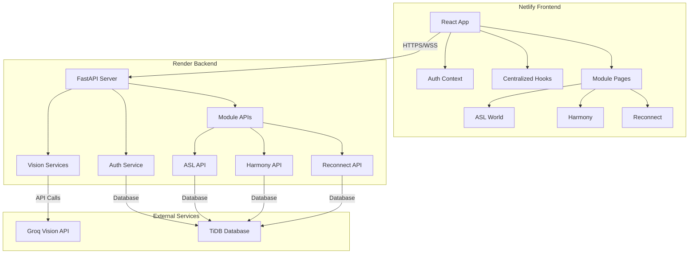

# Design Document

## Overview

The StorySign Platform Refactor implements a comprehensive architectural overhaul that transforms the existing ASL learning platform into a scalable, cloud-ready, multi-module educational system. The design emphasizes modern React patterns, centralized state management, accessibility-first UI components, and a microservices-oriented backend architecture that supports three distinct learning modules: ASL World, Harmony (facial expressions), and Reconnect (therapeutic movement).

## Architecture

### High-Level System Architecture



### Frontend Architecture

The frontend follows a modular, hook-based architecture with centralized state management:

- **Centralized Hooks Layer**: Custom hooks manage webcam, WebSocket, and authentication state
- **Component Library**: Reusable, accessible UI components with ARIA support
- **Module Pages**: Dedicated pages for each learning module with shared components
- **Context Providers**: Global state management for authentication and user data

### Backend Architecture

The backend implements a service-oriented architecture with clear separation of concerns:

- **API Layer**: FastAPI routers for each module with proper error handling
- **Service Layer**: Business logic services for each learning module
- **Repository Layer**: Data access patterns for database operations
- **External Integration Layer**: Secure connections to Groq API and other services

## Components and Interfaces

### Frontend Components

#### Core Hooks

**useWebcam Hook**

```javascript
const useWebcam = () => {
  const [stream, setStream] = useState(null);
  const [isActive, setIsActive] = useState(false);
  const [error, setError] = useState(null);

  const startWebcam = async () => {
    // Implementation with proper error handling
  };

  const stopWebcam = () => {
    // Proper cleanup with track.stop()
  };

  return { stream, isActive, error, startWebcam, stopWebcam };
};
```

**useWebSocket Hook**

```javascript
const useWebSocket = (url) => {
  const [socket, setSocket] = useState(null);
  const [connectionState, setConnectionState] = useState("disconnected");
  const [lastMessage, setLastMessage] = useState(null);

  // Auto-reconnection logic and message handling

  return { socket, connectionState, lastMessage, sendMessage };
};
```

#### Authentication System

**AuthContext Provider**

```javascript
const AuthContext = createContext();

const AuthProvider = ({ children }) => {
  const [user, setUser] = useState(null);
  const [token, setToken] = useState(localStorage.getItem("token"));
  const [isLoading, setIsLoading] = useState(true);

  // Login, logout, and token management methods

  return (
    <AuthContext.Provider
      value={{ user, token, login, logout, isAuthenticated }}
    >
      {children}
    </AuthContext.Provider>
  );
};
```

#### Reusable UI Components

**VideoDisplayPanel Component**

```javascript
const VideoDisplayPanel = ({
  stream,
  overlayData,
  className,
  ariaLabel,
  onFrameCapture,
}) => {
  // Accessible video display with MediaPipe overlays
  // Keyboard navigation support
  // Screen reader announcements for state changes
};
```

**AccessibleButton Component**

```javascript
const AccessibleButton = ({
  children,
  onClick,
  disabled,
  variant,
  ariaLabel,
  loading,
}) => {
  // WCAG compliant button with proper focus management
  // Loading states and keyboard support
};
```

#### Module-Specific Components

**ASL World Components**

- `StorySetup.js`: Topic selection and story generation interface
- `PracticeView.js`: Video display with sentence practice controls
- `FeedbackPanel.js`: AI-generated feedback display with accessibility features

**Harmony Components**

- `ExpressionPractice.js`: Facial expression detection and feedback
- `EmotionMetrics.js`: Real-time emotional analysis display
- `ProgressTracker.js`: Session progress and historical data

**Reconnect Components**

- `ExerciseSelector.js`: Therapeutic exercise selection interface
- `MovementAnalysis.js`: Real-time movement tracking and metrics
- `TherapyDashboard.js`: Progress charts and rehabilitation metrics

### Backend Services

#### Authentication Service

```python
class AuthService:
    def __init__(self, db_service: DatabaseService):
        self.db = db_service
        self.jwt_secret = os.getenv('JWT_SECRET')

    async def authenticate_user(self, email: str, password: str) -> Optional[User]:
        # Secure password verification with bcrypt
        # JWT token generation

    async def verify_token(self, token: str) -> Optional[User]:
        # JWT token validation and user retrieval
```

#### Vision Service Integration

```python
class GroqVisionService:
    def __init__(self):
        self.api_key = os.getenv('GROQ_API_KEY')
        self.base_url = "https://api.groq.com/openai/v1"

    async def analyze_image(self, image_data: bytes, prompt: str) -> str:
        # Secure API call to Groq with proper error handling
        # Image encoding and response processing
```

#### Module-Specific Services

**Harmony Service**

```python
class HarmonyService:
    async def analyze_facial_expression(self, landmarks: List[Dict]) -> EmotionAnalysis:
        # MediaPipe facial landmark processing
        # Emotion classification and confidence scoring

    async def store_session_data(self, user_id: int, session_data: Dict) -> None:
        # Database storage for progress tracking
```

**Reconnect Service**

```python
class ReconnectService:
    async def analyze_movement(self, pose_landmarks: List[Dict]) -> MovementMetrics:
        # Full-body pose analysis
        # Joint angle calculations and range of motion metrics

    async def generate_therapy_feedback(self, metrics: MovementMetrics) -> TherapyFeedback:
        # AI-generated therapeutic feedback
        # Progress assessment and recommendations
```

## Data Models

### User Authentication Models

```python
class User(BaseModel):
    id: int
    email: str
    username: str
    created_at: datetime
    last_login: Optional[datetime]
    is_active: bool = True

class AuthToken(BaseModel):
    access_token: str
    token_type: str = "bearer"
    expires_in: int
    user: User
```

### Module-Specific Models

**ASL World Models**

```python
class Story(BaseModel):
    id: int
    user_id: int
    object_detected: str
    story_content: str
    sentences: List[str]
    created_at: datetime

class PracticeSession(BaseModel):
    id: int
    story_id: int
    sentence_index: int
    landmarks_data: Dict
    feedback: str
    score: Optional[float]
    completed_at: datetime
```

**Harmony Models**

```python
class EmotionSession(BaseModel):
    id: int
    user_id: int
    target_emotion: str
    detected_emotions: List[Dict]
    confidence_scores: List[float]
    session_duration: int
    created_at: datetime

class FacialLandmarks(BaseModel):
    session_id: int
    timestamp: float
    landmarks: List[Dict]
    emotion_classification: Dict
```

**Reconnect Models**

```python
class TherapySession(BaseModel):
    id: int
    user_id: int
    exercise_type: str
    movement_data: List[Dict]
    joint_angles: Dict
    range_of_motion: Dict
    therapy_feedback: str
    created_at: datetime

class MovementMetrics(BaseModel):
    session_id: int
    joint_name: str
    angle_measurements: List[float]
    range_min: float
    range_max: float
    improvement_score: Optional[float]
```

## Error Handling

### Frontend Error Handling

**Global Error Boundary**

```javascript
class GlobalErrorBoundary extends React.Component {
  constructor(props) {
    super(props);
    this.state = { hasError: false, error: null };
  }

  static getDerivedStateFromError(error) {
    return { hasError: true, error };
  }

  componentDidCatch(error, errorInfo) {
    // Log error to monitoring service
    console.error("Global error caught:", error, errorInfo);
  }

  render() {
    if (this.state.hasError) {
      return <ErrorFallback error={this.state.error} />;
    }
    return this.props.children;
  }
}
```

**Hook-Level Error Handling**

```javascript
const useWebcam = () => {
  const [error, setError] = useState(null);

  const startWebcam = async () => {
    try {
      const stream = await navigator.mediaDevices.getUserMedia({ video: true });
      setStream(stream);
      setError(null);
    } catch (err) {
      setError({
        type: "WEBCAM_ACCESS_DENIED",
        message: "Please allow camera access to use this feature",
        userAction: "Check browser permissions and try again",
      });
    }
  };
};
```

### Backend Error Handling

**Custom Exception Classes**

```python
class StorySignException(Exception):
    def __init__(self, message: str, error_code: str, status_code: int = 500):
        self.message = message
        self.error_code = error_code
        self.status_code = status_code
        super().__init__(self.message)

class AuthenticationError(StorySignException):
    def __init__(self, message: str = "Authentication failed"):
        super().__init__(message, "AUTH_ERROR", 401)

class VisionServiceError(StorySignException):
    def __init__(self, message: str = "Vision service unavailable"):
        super().__init__(message, "VISION_ERROR", 503)
```

**Global Exception Handler**

```python
@app.exception_handler(StorySignException)
async def storysign_exception_handler(request: Request, exc: StorySignException):
    return JSONResponse(
        status_code=exc.status_code,
        content={
            "error": exc.error_code,
            "message": exc.message,
            "timestamp": datetime.utcnow().isoformat()
        }
    )
```

## Testing Strategy

### Frontend Testing

**Unit Tests for Hooks**

```javascript
describe("useWebcam Hook", () => {
  test("should handle webcam access denial gracefully", async () => {
    // Mock getUserMedia to reject
    // Test error state and user messaging
  });

  test("should properly cleanup webcam resources", () => {
    // Test track.stop() is called on unmount
  });
});
```

**Integration Tests for Components**

```javascript
describe("ASL World Integration", () => {
  test("complete story generation and practice flow", async () => {
    // Test full user journey from object scan to practice completion
    // Mock backend responses and verify UI state changes
  });
});
```

**Accessibility Tests**

```javascript
describe("Accessibility Compliance", () => {
  test("all interactive elements are keyboard accessible", () => {
    // Test tab navigation and keyboard shortcuts
  });

  test("screen reader announcements work correctly", () => {
    // Test ARIA labels and live regions
  });
});
```

### Backend Testing

**Service Unit Tests**

```python
class TestHarmonyService:
    async def test_facial_expression_analysis(self):
        # Test MediaPipe landmark processing
        # Verify emotion classification accuracy

    async def test_session_data_storage(self):
        # Test database operations
        # Verify data integrity and relationships
```

**API Integration Tests**

```python
class TestHarmonyAPI:
    async def test_emotion_session_creation(self):
        # Test full API workflow
        # Verify authentication, processing, and response format

    async def test_error_handling(self):
        # Test various error scenarios
        # Verify proper HTTP status codes and error messages
```

### End-to-End Testing

**User Journey Tests**

```javascript
describe("Complete User Workflows", () => {
  test("new user registration and first ASL session", async () => {
    // Test registration -> login -> story generation -> practice
  });

  test("returning user accessing all three modules", async () => {
    // Test login -> ASL World -> Harmony -> Reconnect workflows
  });
});
```

## Deployment Configuration

### Netlify Frontend Configuration

**netlify.toml**

```toml
[build]
  command = "npm run build"
  publish = "build"

[build.environment]
  REACT_APP_API_URL = "https://storysign-backend.onrender.com"
  REACT_APP_ENVIRONMENT = "production"

[[redirects]]
  from = "/api/*"
  to = "https://storysign-backend.onrender.com/api/:splat"
  status = 200
  force = true

[[headers]]
  for = "/*"
  [headers.values]
    X-Frame-Options = "DENY"
    X-Content-Type-Options = "nosniff"
    Referrer-Policy = "strict-origin-when-cross-origin"
```

### Render Backend Configuration

**render.yaml**

```yaml
services:
  - type: web
    name: storysign-backend
    env: python
    buildCommand: "pip install -r requirements.txt"
    startCommand: "gunicorn -w 4 -k uvicorn.workers.UvicornWorker main:app --bind 0.0.0.0:$PORT"
    envVars:
      - key: DATABASE_URL
        sync: false
      - key: JWT_SECRET
        sync: false
      - key: GROQ_API_KEY
        sync: false
      - key: ENVIRONMENT
        value: production
    healthCheckPath: "/health"
```

### Environment Variables Management

**Production Environment Variables**

```python
# config.py
import os
from typing import Optional

class Settings:
    # Database
    DATABASE_URL: str = os.getenv("DATABASE_URL", "")

    # Authentication
    JWT_SECRET: str = os.getenv("JWT_SECRET", "")
    JWT_ALGORITHM: str = "HS256"
    JWT_EXPIRATION_HOURS: int = 24

    # External APIs
    GROQ_API_KEY: str = os.getenv("GROQ_API_KEY", "")
    GROQ_BASE_URL: str = "https://api.groq.com/openai/v1"

    # Application
    ENVIRONMENT: str = os.getenv("ENVIRONMENT", "development")
    DEBUG: bool = ENVIRONMENT == "development"

    @property
    def is_production(self) -> bool:
        return self.ENVIRONMENT == "production"

settings = Settings()
```

This design provides a comprehensive foundation for implementing the StorySign Platform Refactor, ensuring scalability, maintainability, and accessibility while supporting the three distinct learning modules and cloud deployment requirements.
