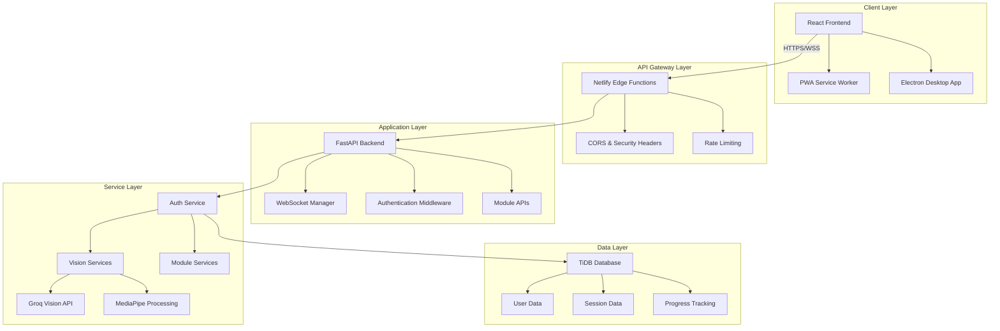

# StorySign Platform Architecture Documentation

## Overview

The StorySign Platform is a comprehensive ASL learning system built with a modern, modular architecture that supports multiple learning modules including ASL World, Harmony (facial expressions), and Reconnect (therapeutic movement). The platform follows a microservices-oriented design with clear separation of concerns between frontend and backend components.

## System Architecture

### High-Level Architecture



### Technology Stack

#### Frontend

- **Framework**: React 18 with Hooks
- **Build Tool**: Create React App with custom webpack config
- **State Management**: React Context API + Custom Hooks
- **Styling**: CSS Modules + Accessibility-first design
- **Testing**: Jest + React Testing Library + Axe accessibility testing
- **PWA**: Service Worker for offline functionality
- **Desktop**: Electron for cross-platform desktop app

#### Backend

- **Framework**: FastAPI with async/await support
- **WebSocket**: FastAPI WebSocket for real-time communication
- **Computer Vision**: MediaPipe for pose/face/hand detection
- **AI Integration**: Groq Vision API for cloud-based analysis
- **Database**: TiDB (MySQL-compatible) with async drivers
- **Authentication**: JWT tokens with bcrypt password hashing
- **Testing**: pytest with async support

#### Infrastructure

- **Frontend Hosting**: Netlify with CDN and edge functions
- **Backend Hosting**: Render with auto-scaling
- **Database**: TiDB Cloud for global distribution
- **CI/CD**: GitHub Actions with automated testing and deployment

## Directory Structure

### Frontend Structure

```
frontend/src/
├── components/           # Reusable UI components
│   ├── common/          # Shared components (Button, Modal, etc.)
│   ├── auth/            # Authentication components
│   ├── video/           # Video processing components
│   └── [module]/        # Module-specific components
├── modules/             # Learning module implementations
│   ├── asl_world/       # ASL learning module
│   ├── harmony/         # Facial expression module
│   └── reconnect/       # Therapeutic movement module
├── pages/               # Top-level page components
├── hooks/               # Custom React hooks
│   ├── useWebcam.js     # Centralized webcam management
│   ├── useWebSocket.js  # WebSocket connection management
│   └── useAuth.js       # Authentication state management
├── contexts/            # React Context providers
├── services/            # API communication layer
├── utils/               # Utility functions
├── styles/              # Global styles and themes
├── tests/               # Test suites
│   ├── accessibility/   # Accessibility compliance tests
│   └── e2e/            # End-to-end user journey tests
└── docs/               # Component documentation
```

### Backend Structure

```
backend/
├── api/                 # FastAPI route handlers
│   ├── auth.py         # Authentication endpoints
│   ├── asl_world.py    # ASL World module API
│   ├── harmony.py      # Harmony module API
│   ├── reconnect.py    # Reconnect module API
│   └── websocket.py    # WebSocket endpoints
├── services/            # Business logic layer
│   ├── auth_service.py # Authentication business logic
│   ├── vision_service.py # Computer vision processing
│   └── [module]_service.py # Module-specific services
├── models/              # Pydantic data models
│   ├── base.py         # Base model classes
│   ├── user.py         # User-related models
│   └── [module].py     # Module-specific models
├── repositories/        # Data access layer
│   ├── base_repository.py # Base repository pattern
│   └── [entity]_repository.py # Entity-specific repositories
├── core/                # Core infrastructure
│   ├── database.py     # Database connection management
│   ├── config.py       # Configuration management
│   └── security.py     # Security utilities
├── middleware/          # Request/response middleware
├── migrations/          # Database schema migrations
└── tests/              # Test suites
```

## Core Design Patterns

### Frontend Patterns

#### 1. Custom Hooks Pattern

Centralized state management and side effects through custom hooks:

```javascript
// useWebcam.js - Centralized webcam management
const useWebcam = () => {
  const [stream, setStream] = useState(null);
  const [isActive, setIsActive] = useState(false);
  const [error, setError] = useState(null);

  const startWebcam = useCallback(async () => {
    try {
      const mediaStream = await navigator.mediaDevices.getUserMedia({
        video: true,
      });
      setStream(mediaStream);
      setIsActive(true);
      setError(null);
    } catch (err) {
      setError(err);
    }
  }, []);

  const stopWebcam = useCallback(() => {
    if (stream) {
      stream.getTracks().forEach((track) => track.stop());
      setStream(null);
      setIsActive(false);
    }
  }, [stream]);

  useEffect(() => {
    return () => stopWebcam(); // Cleanup on unmount
  }, [stopWebcam]);

  return { stream, isActive, error, startWebcam, stopWebcam };
};
```

#### 2. Module Pattern

Each learning module follows a consistent structure:

```javascript
// modules/asl_world/index.js
export { default as StorySetup } from "./StorySetup";
export { default as PracticeView } from "./PracticeView";
export { default as FeedbackPanel } from "./FeedbackPanel";
export { default as ASLWorldProvider } from "./ASLWorldProvider";
```

#### 3. Accessibility-First Components

All components implement WCAG 2.1 AA compliance:

```javascript
// components/common/Button.js
const Button = ({
  children,
  onClick,
  disabled = false,
  variant = "primary",
  ariaLabel,
  loading = false,
  ...props
}) => {
  return (
    <button
      className={`btn btn--${variant} ${loading ? "btn--loading" : ""}`}
      onClick={onClick}
      disabled={disabled || loading}
      aria-label={ariaLabel || children}
      aria-busy={loading}
      {...props}
    >
      {loading ? <LoadingSpinner /> : children}
    </button>
  );
};
```

### Backend Patterns

#### 1. Service Layer Pattern

Business logic separated from API endpoints:

```python
# services/harmony_service.py
class HarmonyService:
    def __init__(self, repository: HarmonyRepository):
        self.repository = repository
        self.mediapipe_processor = MediaPipeProcessor()

    async def analyze_facial_expression(
        self,
        user_id: int,
        image_data: bytes
    ) -> EmotionAnalysis:
        """Analyze facial expression and return emotion data."""
        landmarks = await self.mediapipe_processor.process_face(image_data)
        emotion_data = self._classify_emotion(landmarks)

        # Store session data
        session = await self.repository.create_session(
            user_id=user_id,
            emotion_data=emotion_data
        )

        return EmotionAnalysis(
            session_id=session.id,
            detected_emotions=emotion_data.emotions,
            confidence_scores=emotion_data.confidence
        )
```

#### 2. Repository Pattern

Data access abstraction:

```python
# repositories/base_repository.py
class BaseRepository:
    def __init__(self, db_session: AsyncSession):
        self.db = db_session

    async def create(self, model_data: dict) -> BaseModel:
        """Create a new record."""
        pass

    async def get_by_id(self, id: int) -> Optional[BaseModel]:
        """Retrieve record by ID."""
        pass

    async def update(self, id: int, update_data: dict) -> BaseModel:
        """Update existing record."""
        pass

    async def delete(self, id: int) -> bool:
        """Delete record by ID."""
        pass
```

#### 3. Dependency Injection Pattern

Services injected through FastAPI's dependency system:

```python
# api/harmony.py
@router.post("/sessions")
async def create_emotion_session(
    session_data: EmotionSessionCreate,
    current_user: User = Depends(get_current_user),
    harmony_service: HarmonyService = Depends(get_harmony_service)
) -> EmotionSessionResponse:
    """Create new emotion analysis session."""
    result = await harmony_service.analyze_facial_expression(
        user_id=current_user.id,
        image_data=session_data.image_data
    )
    return EmotionSessionResponse.from_analysis(result)
```

## Module Architecture

### ASL World Module

Focuses on sign language learning through object detection and story generation.

**Components:**

- `StorySetup`: Object scanning and topic selection
- `PracticeView`: Video practice with real-time feedback
- `FeedbackPanel`: AI-generated learning feedback

**Data Flow:**

1. User scans object with webcam
2. Groq Vision API identifies object
3. Story generated based on detected object
4. User practices signs with MediaPipe feedback
5. Progress stored in database

### Harmony Module

Focuses on facial expression and emotion recognition training.

**Components:**

- `ExpressionPractice`: Facial expression detection interface
- `EmotionMetrics`: Real-time emotion analysis display
- `ProgressTracker`: Historical emotion data visualization

**Data Flow:**

1. User activates facial expression mode
2. MediaPipe processes facial landmarks
3. Emotion classification performed
4. Real-time feedback provided
5. Session data stored for progress tracking

### Reconnect Module

Focuses on therapeutic movement analysis and rehabilitation.

**Components:**

- `ExerciseSelector`: Therapeutic exercise selection
- `MovementAnalysis`: Full-body pose tracking
- `TherapyDashboard`: Progress metrics and charts

**Data Flow:**

1. User selects therapeutic exercise
2. MediaPipe tracks full-body pose
3. Joint angles and range of motion calculated
4. Quantitative feedback provided
5. Therapeutic progress stored

## Security Architecture

### Authentication & Authorization

- JWT tokens with secure HTTP-only cookies
- bcrypt password hashing with salt rounds
- Role-based access control (RBAC)
- Session management with automatic token refresh

### Data Protection

- HTTPS/WSS encryption for all communications
- Input validation and sanitization
- SQL injection prevention through parameterized queries
- XSS protection through Content Security Policy

### API Security

- Rate limiting to prevent abuse
- CORS configuration for cross-origin requests
- Request size limits for file uploads
- API versioning for backward compatibility

## Performance Considerations

### Frontend Optimization

- Code splitting by module for faster initial load
- Lazy loading of non-critical components
- Image optimization and WebP format support
- Service Worker caching for offline functionality

### Backend Optimization

- Async/await for non-blocking I/O operations
- Connection pooling for database connections
- Caching layer for frequently accessed data
- Background task processing for heavy computations

### Real-time Processing

- WebSocket connection pooling
- Frame throttling to prevent overwhelming backend
- MediaPipe processing in separate threads
- Adaptive quality based on network conditions

## Scalability Design

### Horizontal Scaling

- Stateless backend services for easy scaling
- Load balancing through Render's infrastructure
- Database read replicas for improved performance
- CDN distribution through Netlify

### Vertical Scaling

- Efficient memory usage in MediaPipe processing
- CPU optimization for computer vision tasks
- Database indexing for fast query performance
- Caching strategies to reduce database load

## Monitoring & Observability

### Application Monitoring

- Health check endpoints for service status
- Performance metrics collection
- Error tracking and alerting
- User analytics and usage patterns

### Infrastructure Monitoring

- Server resource utilization
- Database performance metrics
- Network latency monitoring
- Deployment success/failure tracking

## Development Workflow

### Code Quality

- ESLint and Prettier for JavaScript formatting
- Black and isort for Python code formatting
- Pre-commit hooks for code quality checks
- Automated testing in CI/CD pipeline

### Testing Strategy

- Unit tests for individual components/services
- Integration tests for API endpoints
- End-to-end tests for user workflows
- Accessibility testing with automated tools

### Deployment Process

- Feature branch development workflow
- Pull request reviews and automated testing
- Staging environment for pre-production testing
- Blue-green deployment for zero-downtime updates

This architecture provides a solid foundation for the StorySign platform's current needs while maintaining flexibility for future enhancements and scaling requirements.
